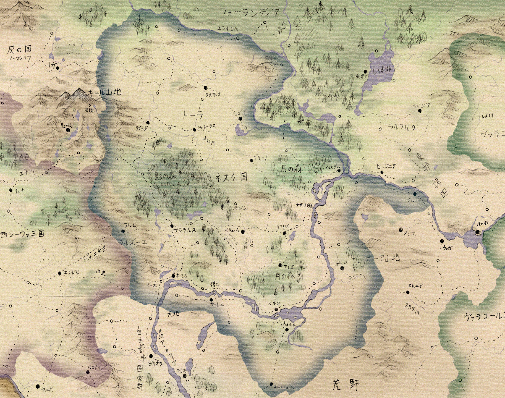

# **ネス公国**  森と鉄と騎士の国

ネス公国は大河中流域に広がる封建制国家であり、南部の森林地帯と、北部の平原からなる。

人口は約800万人。人種は西方系と東方遊牧民の血が入り交じっている。

名目上は大シーウァ王国の一部だが、実質的には独立国家となっている。

君主は大公だが、他国の王と同格であり、陛下と称される。

[地理と生活](地理と生活.md) 

[歴史](歴史.md)

[騎士と貴族](騎士と貴族.md)
