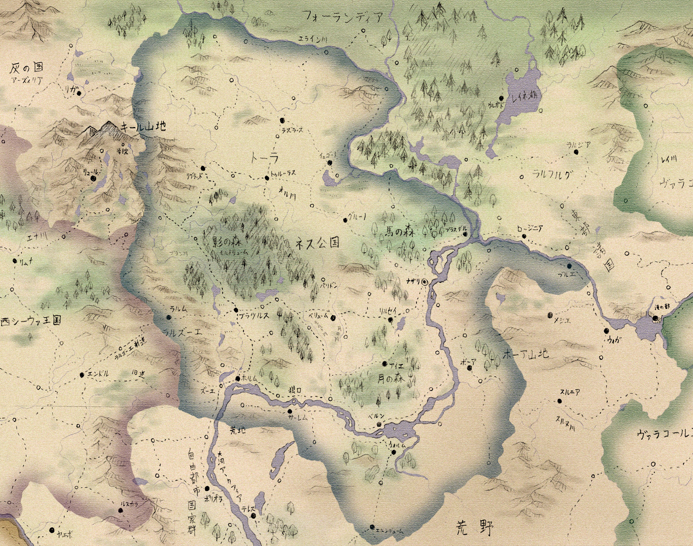
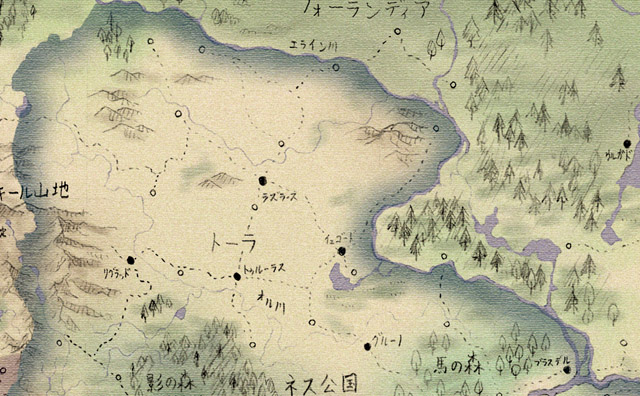
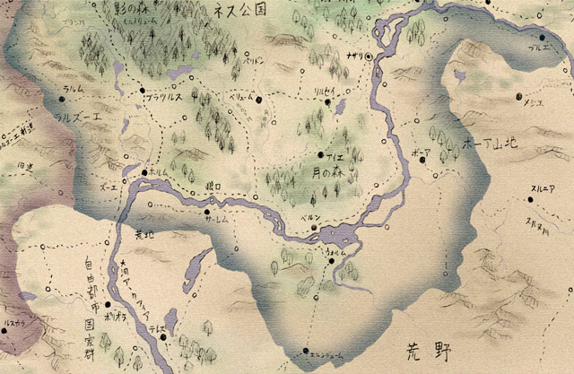

# 地理と生活

ネス公国は南北で違う顔を持つ。
南部は森が多いが、点在する町や村の周囲には広い農地が拓かれている。河畔の都市は大河交易で栄え、南東の絹や磁器、北の木材や毛皮、西の穀物や羊毛が、ネスの鉄や商品作物と取引されている。
対して北部では大規模な農業と、鉄の採掘が行われている。さらなる農地を求めてフォーランディアの森林地帯への殖民が行われていて、元々の住民との争いが起きている。

支配者層も二つに分かれている。
一つは、建国時からの領地を持つ諸侯たちである。主要な地域を支配し、既得権を守っている。
対して、新興貴族や大商人たちの層がある。彼らは地位向上や新たな市場を求めているが、古くからの諸侯たちに阻まれている。

## 中央部――ネスの中心地

古くから繁栄し、都市や大貴族の所領が多い。
広い森があるが、町の周辺には農地が拓かれている。

### ナザリ
ネス公国の首都。かつてネスの建国時、テオル一世が城を構え、のちに人々が集まって都市になったという。
鉄製品の生産がさかん。

・黒鳥宮
大公の居城。ナザリの北側にある。
古い形の円形城塞と、近年に建てられた壮麗な宮殿からなる。

・閣下通り
黒鳥宮近くの北門から南門、船着き場までを繋ぐ大通り。
大規模な商館や役場、神殿、組合会館などが軒を連ねる。
名前の由来は、大商人たちがお世辞で閣下と呼ばれたことから。

・大市場
閣下通りと西門を繋ぐ道の途中にある広場。小売り店舗が並ぶ。

・城壁通り
住宅地に近い環状道路で、庶民的な街並み。南側は繁華街になっている。

・鍛冶場通り
大小さまざまな鍛冶工房がある。
ナザリの鉄製品は大シーウァ一の品質。

・薬草通り
ナザリの南側には薬屋や占い師が店を開いている通りがあるが、ここの住人たちは魔術師だと噂されている。
魔術への抑圧が少ない東方ならではの光景。

・オローディア城塞
ナザリ近くの大河の中州には、魔国時代から使われてきたオローディア城塞がある。
元々の城は崩れてしまっているが、その土台を再利用して新たな砦が建てられた。現在はナザリを守る一方、牢獄としても使われている。

### 馬の森
大公の直轄領であり、ナザリの近郊は広大な狩り場として使われている。
このどこかに、テオル一世の手で「魔国の宝」が隠されたという伝説がある。

### リルゼイ
リルゼイ大学がある。

かつてナザリでの仕官を目指した若者たちが、勉強しようと金を出し合って講師を雇ったのが始まりで、今でも学生が学長を務める。

きちんとした校舎などもなく、下宿屋や神殿の建物を借りている。

### ウォルム湖
ウォルム湖の湖畔は、大河による東西の水運と、南北の陸路による流通の中継地として栄えていて、白い帆をかけた商船が日々行き交っている。

また北岸にあるベルン侯爵領は風光明媚な土地で、月の森の南側に美しい田園地帯が広がり、ビールの生産が行われている。ここはアルソンの出身地でもある。

### アイエ神殿領
月の森の中心部に位置する聖地。1700年も昔に建てられたというイバの大神殿があり、聖職者育成のための学問所がある。

この町では鹿が聖獣とされていて、町中で鹿が放し飼いにされ、「人より鹿が多い」「鹿が人を襲う」「鹿しかいない」などと噂される。

聖域外では特に保護されていないため、付近の農村では鹿肉がよく食べられる。

四年に一度、奇祭「鹿相撲」が催される。

### パリドン
影の森に近い町。東のほうに鉄鉱山があるが、採掘量は減ってきている。
二百年ほど昔、ここの鉱山の奥で、機械仕掛けの人間が掘り出されたという伝承がある。
普通の人のように喋り、ものも食べたが、数十年ほどすると壊れて動かなくなったという。

### 「白き魔女の会」

ナザリに住む貴族の婦人や令嬢たちは、以前から刺激を求めて魔術の会合を開いていた。それは「白き魔女の会」と呼ばれる。

魔術と言っても、かつては薬草通りの魔術師から「秘薬」を買ったり、占いをしたりといったたわいのないものだった。

しかし新しい指導者を得てからは、本格的な現象魔術や召喚魔術などを学び合うようになり、わずか数ヶ月で急速に魔術結社としての形を整えた。
現在では才能のある「魔女」たちが選び出され、特別な務めに携わっているという。

その指導者は滅多に姿を見せず、夜闇の中にだけ出現し、夜明けとともに消える。
彼女は、ヴァラメアの魔女と呼ばれている。

## 北部――平原と入植地

ネス公国の北半分は、平原に覆われている。さらに北へ進むと国境のエライン川があり、その向こうにはフォーランディアの大森林がある。

### トーラ地方
キール山地から吹き下ろす強風に晒された平原地帯である。風は冷たく乾いていて、平原の草を灰色に枯らす。街道を歩くと短冊状に区分けされた畑が左右に見え、農家の暖炉では泥炭が燃えている。

ここの土地は痩せているが、二度のシーウァ継承戦争の後に授封された騎士たちに開拓されたことで、広大な農地になった。

トゥルーラスとラズラースの二都市の周辺が特に拓けている。

### トゥルーラス
トーラ地方の中心都市の一つ。領内にシャーリックの神殿と、その神殿領を抱えている。

### イェゴード
歴史のある侯爵領だが、あまり栄えてはいない。

湖での漁業が行われている。名物はうなぎパイ。

### リグラッド
古くからの鉱山町。ここで得られた鉄鉱石は近くで銑鉄に加工され、船で東部へと運ばれる。

この地を治めるリグラッド伯爵は代々人前に出ることを避けていて、ほとんど姿を見せていない。

噂によれば、かつて初代のリグラッド伯が影の森の中心部で何かを見つけ、それからは姿を隠すようになったのだという。

### エライン川周辺
この辺境地帯には、過去の戦争で功績を挙げた騎士たちに与えられた小規模な土地が多い。

当初は領地とは名ばかりの森や湿地だったが、百年以上の悪戦苦闘のすえ、ようやく農地として使えるようになってきている。

彼らはさらなる収穫を求め、エライン川を越えて入植地を作ろうとしているが、それがフォーランディアの諸部族との争いを生んでいる。

また入植地の開拓民たちが、森の奥から現れる「奇妙な怪物」に襲われる事件が多発している。

> **エライン川の怪物**
> 
> オラ、見っただよ……。
> 
>森の奥のほうがビカッ！ビカッー！
>
>って光って、
>
>森がドドーン！
>
>って爆発したみたいになって、ヤツが出ただよ！
>
>うわあっ……うわああああああっ！！
>
> 
> 
> （開拓民からの聞き書きより）

## 南東部――荒野の入り口

ネス公国の南東部、大河の南岸には乾燥した山地が多い。

### ボーア
なだらかな岩山の裾野を、細い道が曲がりくねって続いている。ボーアはそんな土地である。

この地域の諸部族はネスよりも荒野人に近く、神殿の正当とも違った独自の信仰を保っている。また、辺境には魔国時代の生き物が生き残っているとも噂される。

南東部の主導的立場にあるボーア侯爵は、東部諸国の王たちに対する影響力を強めつつあり、ネス公国とは別個の国の支配者だとも言える。

### ブルエ
元々は独立した小国家だったが、東部諸国のメジエとの戦争にネス公国が介入し、伯爵領として支配下に入った。

現在も隣のメジエとは仲が悪いが、常に熱心な援軍が得られるわけではなく、不安定な立場にある。

### エルンデューム
ネス公国の南端にあり、荒野やメトセラ教国との交易路の途中にある。教国との交易は禁止されているが、それを守る商人は少ない。

荒野の交易路は盗賊に襲撃されやすく、護衛志願の傭兵たちもよく集まる。彼らが途中で盗賊に早変わりすることもある。
エルンデューム伯は南からの侵略を危惧しているが、中央からは無視されがち。

## 南西部――関所の国
ネスの南西部は、古くは関所の国と呼ばれた。曲がりくねる大河と、キール山から伸びるラルズーエの丘陵地帯に挟まれた、要害の地だからである。そのため自然と国同士の境になり、何度も戦場になった。

西シーウァからラルズーエ旧道経由でネス公国を目指すと、狭い峠道や谷底を歩き続けることになる。ねじれた木々の森を抜け、丘を一つ越えると、坂を下った先に大河の水面が光って見える。

東に歩き続けると森や湖沼が増え、川沿いには小さな町や村が並んで、のどかな様子を見せる。要所要所には砦が立ち、街道に影を落とす。

> ### **ホルム**
>
> 
>
> ホルムは、そんな南西部の代表的な町である。
>大河交易の中継点として使われていて、船着き場には商館が並ぶ。その割には垢抜けない印象があるのは、陸の交易路から少し外れているからだろう。
>
>城壁が立派なのは国境に向いた側だけで、北に回ると所々欠けているのが分かる。道は木々と柵の間を通って水車小屋まで続く。ホルムの街並みは森に包まれている。
>
>しかし、よく見れば周辺の農地は何者かに荒らされ、人の姿はない。草むらには家畜の死体が転がっている。町の中には武装した傭兵やならず者がうろついている。
>この町で発見されたというアルケア帝国の遺跡と、それによる怪異の影響である。
>
>遺跡は町のすぐ近く、森の中にある。兵士たちの横を通り、小川の流れ出る洞窟に入ると、地底湖の水面から突き出るようにして、四角錐状の構造物が見える。
>構造物は黒い石でできていて、古代語の碑文が刻まれていた。
>
>『我らの都と、皇帝の栄光を守護したまえ。アーガデウムよ、とこしえに栄えよ』
>
>石の表面には大きな穴が開いていて、中に入れるようになっている。
>この穴の奥から、伝説の怪物に過ぎなかった夜種たちが現れて、町の周辺に広がり、人々を襲うようになった。さらに奇病の流行、飢饉など、さまざまな災厄が広がった。
>
>それらの異変の原因は遺跡の内部にあると考えられ、兵士たちや有志の探索者たちが遺跡内に送り込まれたが、いまだ解決していない。
>
>生きて帰還した者たちの報告によれば、内部には洞窟や巨大空洞、地下宮殿などがあり、怪物たちがはびこっているという。
>
>災厄の原因を突き止めれば報償を与える、と大公が告知したこともあって、ホルムには戦士や学者、探検家、無頼漢など、探索者と呼ばれる者たちが集まってきている。
>
>彼ら目当てに商売をする者も増え、町は以前より活気を見せている。反面、うさんくさい商売をする者や、周辺の洞窟などにひそんで旅人を襲う者が出るなど、問題も増えている。
>
> 
>
> うさんくさい商売
>
>
> また、ホルムにはポララポという郷土料理がある。
>魚の内臓と果物を香辛料とともに発酵させたもので、瓶詰めにして保存される。パンに塗ったり、酒のつまみとして食べる。
>
>地元のお爺ちゃんお婆ちゃんたちから絶大な支持を受けているが、若者からは「もっと普通の名物が欲しい」と毛嫌いされている。
>
>旅人と見れば食べさせようとしてくるので要注意。
>
> ---
>
>・丘の砦
>ホルムとラルズーエの境界には谷川が流れ、橋が架かっている。それを見下ろすように建つ砦は、単純に「丘の砦」と呼ばれている。
>
>ネスがシーウァと分裂した頃に作られたもので、国境地帯を守る拠点であり、ホルム伯の居城になっていた時期もあった。今はホルム伯配下の騎士と、国境警備隊が駐屯している。
>
>この砦の建つ丘は不自然なほど綺麗な円形をしていて、以前は妖精の丘とも呼ばれていた。丘の下には地下世界があり、妖精が住むとの伝説があるためである。そこには湖の中から入れると伝えられている。
>
>
>
>・オーセル
>
>森の中にある小さな村。付近に伝わる伝説の収集に良い。
>
>
>
>・シリン
>
>ラーヤ神殿に領有されている村。高台に建つ神殿は木の梁が特徴的で美しい。北側の平原には牧草地が広がる。
>
>
>
>・レンデューム
>
>丘陵地帯の谷間にある村で、羊や山羊の飼育が行われている。
>この村の住人は魔国時代末期に東から移住してきた人々で、父祖伝来の特殊な武術を使うことができ、その技を生かして傭兵として出稼ぎに出ることもある。
>
>当人たちは「自分たちの使う技って珍しいのかな？」程度に思っていたが、災厄の発生後、集まった探索者たちから「ニンジャだニンジャだ」と言われて、初めて自分たちが忍者であると気付いた。
>今では「闇に生き闇に死す。それが我々……ＮＩＮＪＡだ……」とノリノリである。
>
>元々は一族の長を領主として自立していたが、三十年前のラルズーエ戦争で西シーウァ側について戦い、敗北した。
>抵抗が激しかったためネス大公は怒り、長を処刑しようとしたが、ホルム伯が助命を願ったために許した。そのため現在、レンデュームの長は騎士としてホルム伯に仕えている。
>
>
>
>・巨人の踊り舞台
>
>ホルムの北東、丘の上にある環状列石。土地の人々は巨人の踊り舞台と呼び、夜中に近寄ると巨大な亡霊に呪われると噂している。
>ここに限らず、ホルムの周辺には巨石の並ぶ場所が多い。多くは地形を無視して直線状に並べられ、途切れ途切れに地平線の向こうへと続いている。
>土地のまじない師であるデネロス氏は、古代の魔術的な移動装置の痕跡ではないかと推測している。
>
>
>
>・荒れ地
>
>ホルムの南西、大河の褶曲部には草木も生えない荒れ果てた土地が広がっている。砕けた巨石を積み重ねたような地盤をしていて、歩くのにも苦労する。
>かつての天変地異の跡ではないかと言われている。満月の夜には死霊たちが集まり、生前の生活を繰り返しているとも噂される。
>
>
>
>・岩山
>
>ホルムとブラツルスの間にある山地には、古代の遺跡がいくつか残っているらしい。

### ブラツルス
西シーウァからの街道は、ここを通ってナザリに向かう。大河沿いのホルムとも近い。そのためネスと西シーウァの商人の取引所として栄えている。

### ラルズーエ
ネスと西シーウァの国境地帯。北部のラルムと南のズーエの二地方からなる。

ラルズーエ戦争でネス公国の領土になり、各都市は大公直属という形で自治を認められている。

### 狼口
大河の途中にある難所。何も知らずに水面から突き出た岩をよけると、浅瀬に乗り上げてしまう。

月夜には水中から怪物が出るとの伝説もある。ここを嫌って、ウォルム湖畔から陸路を選ぶ交易商人も多い。

以前は水賊も出たが、最近は少ない。

### 影の森
いまだ開墾の進まない森林地帯。巨大な木々が密生し、頭上の枝葉は地面を影で覆い、人の手を寄せ付けない。

中心部にはモルドリュームと呼ばれる遺跡があると伝えられているが、確かめた者は少ない。

その他にも謎の遺跡が多い。

> **ネス公国の鉄と水運**
>
>ホルム在住のネルさんは、新進気鋭の鍛冶職人です。
>
>乙女心あふれる彼女は、人へのプレゼントとして愛をギュギュッと込めた武器を作ることにしました。人斬り包丁を送られた方は困るんじゃないでしょうか。
>
>普段はあり合わせの鉄屑を材料にすることも多いのですが、今回は奮発して、質が良いと評判のリグラッド産の鉄を仕入れて使うことにしました。
>
>さて、リグラッドの鉄がどうやってホルムまで届くのか見てみましょう。
>
>リグラッドの鉱山で掘り出された鉄鉱石は、まず町の工場でインゴットに加工されます。
>鉄鉱石を炉の中に積み重ねた木炭と共に入れ、ふいごで風を送りながら熱すると、不純物が溶け出て、スポンジ状に小穴が開いた銑鉄が残ります。
>
>これをハンマーで叩いて棒状に加工し、麻布で梱包して出荷します。
>
>ホルムまで直線距離では近いのですが、重い鉄塊を陸路で運ぶのは難しいので、まず小舟に乗せてオル川を下り、東に運びます。
>
>途中には何箇所か水門があって、水位を調節して航行しやすいようにしてます。
>
>大河に辿り着いたら、大型の平底船に移し替えます。簡単に作られたこの船は下流までの一方通行用で、河口にまで着いたら木材にされます。
>
>河を遡りたい時には、大型の帆と櫂をそなえた遡上用の船や、河岸の道から馬にロープで曳かせて動かす船などもあります。
>
>大河の神官たちは彼らのために良い西風を祈り、時には自ら魔術で船を動かしてあげます。
どうでもいいですが、途中で都市や城の横を通るたびに関税を取られます。どうでもよくないですね。
>
>南まで下って、首都のナザリへ。
>
>ここは鉄工のさかんな都市で、鉄の多くがここで消費されます。鉄を鋼鉄に変え、刀剣類に加工できるのはナザリ職人の名人芸あっての事です。
>
>さらに南へ行くと、途中で大河は西に流れを変え、ウォルム湖に注ぎます。
>
>荷物が軽いものだったらここで荷馬車に積み替えられ、陸路で自由都市国家群や荒野地方を目差します。というのも、ここから西の大河は「狼口」などの難所で座礁が多いからです。
>
>ちなみにホルムのあたりも、河岸が荒地になっているせいで遡上が難しく、けっこうな難所です。
>
>大河を西に下り、ようやくホルム。もちろん船は南西の自由都市国家群や西シーウァまで目指しますが、この旅はひとまずゴールです。
>
>さてネルさん、無事にリグラッド産の鉄は届きましたか？
>「え？自分で行って買ってきちゃったよ。背負って運んだ方が安いし、速いから」
>
>普通は無理です。