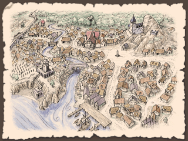

# 地理与生活
涅斯公国拥有着南北相违的面孔。

（尽管）南部森林众多，（但）星罗棋布的村镇周围（仍）开垦出广大的耕地。河畔的都市（因）大河交易繁荣昌盛，东南部的绢和瓷器、北部的木材和毛皮、西部的谷物和羊毛，（都在此处）与涅斯的铁和商品作物进行交易。

相对而言，北部则进行大规模的农业（开垦）与采掘铁（矿）。（为了）寻求更多耕地，（涅斯）向弗兰迪亚（边林）的森林地带进行殖民，与原住民间发生了争斗。

统治阶级也分为两部分。

其一是，自建国时便拥有领地的诸侯们。（诸侯们）支配着主要地域，保守着既得权利。

相对而言，则是新兴贵族和大商人们的阶层，他们追求地位的提升与新市场，但被自古相承的诸侯们阻挠。

## 中部——中心地带

自古繁荣，多为都市和大贵族的领地。

虽然有广阔的森林，但在城镇的周边有农田。

### 纳泽利

涅斯公国的首都。据说，在公国建立之时，泰奥罗一世建起了城堡，后来人们聚集在一起成为城市。

铁制品生产繁荣。

**黑鸟宫**

大公的居城，在纳泽利北侧。

由古老形状的圆形城堡和近年建造的壮丽宫殿组成。

**阁下大街**

从黑鸟宫附近的北门到南门，通往码头的大街。

大规模的商馆、政府机关、神殿、工会会馆等鳞次栉比。

名字的由来是大商人们被恭维地称为阁下。

**大市场**

阁下大街和西门相连道路中途的广场。零售商店鳞次栉比。

**城墙大街**

住宅区附近的环状道路，平民化的街道。南侧是繁华街。

**锻冶场大街**

有大小不一的锻冶工房。

纳泽利的铁器质量是大席瓦尔第一。

**药草街**

在纳泽利南侧有药店和占卜师的店，但这里的居民们被传说是魔术师。

（也算是）对魔术的迫害较少的东部特有的景象。

**奥罗迪亚堡垒**

在纳泽利附近的大河河心岛上，有从魔国时代开始使用的奥罗迪亚堡垒。

原本的堡垒倒塌了，但（公国）在断壁残垣上建立了新的城堡。现在一方面保护着纳泽利，另一方面也被用作监牢。

### 马之森
大公的直辖领，在纳泽利近郊，被用作广阔的狩猎场。

在这个地方，有“泰奥罗一世获得的‘魔国之宝’就藏在这里”的传说。

### 里尔泽
此处有里尔泽大学。

以前以在纳泽利做官为目标的年轻人们，为了学习而出钱雇佣讲师，这就是（里尔泽大学的）开始。至今仍由学生担任校长。

没有像样的校舍，租了公寓和神殿的建筑。

### 沃尔姆湖
在沃尔姆湖的湖畔，因作为大河带来的东西方水运和南北陆路流通的中转地而繁荣着，挂着白帆的商船每天来来往往。

另外，北岸的拜伦侯爵领是一片风光明媚的土地，在月之森的南侧有一片美丽的田园地带，生产啤酒。这里也是艾尔森的出身地。

### 艾耶神殿领
位于月之森的中心的圣地。有着1700年前建造的伊波大神殿，是为了培养圣职者而设立的学问所。

在这个镇子里，鹿被认为是圣兽，在全镇都有放养的鹿，有“鹿比人多”“鹿袭击人”“只有鹿”等传言。

因为在圣域外没有特别保护，所以附近的农村经常吃鹿肉。

每四年举办一次“鹿相扑”的奇特祭典。

### 帕立东
靠近影之森的城镇。东边有铁矿矿山，但是开采量在减少。

传说，在大约二百年前，这里的矿山深处挖出了机器人。

像普通人一样说话，吃东西，但过了几十年左右就坏了，动不了了。

### “白色魔女之会”
住在纳泽利的贵妇人和大小姐们，从以前开始就为了寻求刺激而召开魔术聚会。那被称为“白色魔女之会”。

虽说是魔术，但过去也只是从药草大街的魔术师那里买“秘药”、占卜等无聊的东西。

然而，在得到新的指导者之后，（她们）开始互相学习真正的现象魔术和传唤魔术等，仅仅几个月就迅速形成了魔术结社。

据说，现在有才能的“魔女”们被选中，参与了特殊任务。

那个指导者很少出现，只出现在黑夜中，随着黎明消失。

她被称为魔女。

## 北部——平原和开拓区
涅斯公国的北半部被平原覆盖。更北边是构成国境的艾莱茵河，对面则是弗兰迪亚的大森林。

### 图拉地区
(此地是)曝露在自基鲁山地吹下的强风中的平原地带。风冷而干燥，平原上的草干枯发灰。行走在街道上，可以看到左右是被区分成短册状的田地；农家的暖炉中燃烧着泥炭。

此处的土地（虽然）贫瘠，（但）经由两次席瓦尔继承战争后受封（于此）的骑士们的开垦，形成了广阔的耕地。

图卢拉斯和拉苏拉斯两座都市的周边（耕地更是）开垦的特别多。

### 图卢拉斯
图拉地方的中心都市之一。领地内拥有夏里克的神殿及其神殿领地。

### 叶高多
虽说是历史悠久的侯爵领地，但不怎么繁荣。

（居民在领地内的）湖上进行渔业活动。名产是鳗鱼派。

### 里格拉德
自古以来就是矿山镇。这里获取的铁矿石在近处被加工成生铁，由船运往东部。

统治此地的里格拉德伯爵代代都回避现于人前，几乎无法见到其踪影样貌。

根据流言所说，从前初代里格拉德伯爵在影之森的中心地区发现了什么，从那以后便遁迹藏形，不再见人。

### 艾莱茵河周边
这块边境地带，多是授予在过去战争中立下功绩的骑士们的小规模土地。

当初虽名为领地，（其实）多是森林和湿地；但经过百年以上的恶战苦斗，（这些地方）已经可以很好的作为耕地来使用了。

彼等（领主们）为了寻求更多收获，（开始）越过艾莱茵河建立殖民地；（因）此事与弗兰迪亚的诸部族产生了纷争。

此外，殖民地的开拓者们被从森林深处出现的“奇异的怪物”袭击的事件也频频发生

## 东南部——荒野的入口

涅斯公国的东南部，（亦即）大河南岸多有（气候）干燥的山地。

### 波阿
岩山脚下坡度平缓的原野间，细长的道路蜿蜒曲折伸向远方。波阿就是这样的土地。

此地区的诸部族相较涅斯人而言更接近荒野人，保存着与神殿的“正当”（信仰）相违的自身独有的信仰。此外，边境上还有魔国时代的生物在此仍有孓余的传言。

执东南部之牛耳的波阿侯爵，对东部诸国的国王们保有很强的影响力，（甚至）对涅斯公国来讲可以说是别成一国的支配者。

### 布尔耶
本是独立的小国，但在与东部诸国中的梅吉耶的战争中由于涅斯公国的介入而成为了公国统治下的伯爵领地。

现在与近邻的梅吉耶关系依然恶劣，由于常常得不到热心的援军而立场不稳。

### 艾伦蒂姆
位于涅斯公国南端，坐落于与荒野和玛土撒拉教国间的商路上。虽说与教国间的交易是被禁止的，但守候在此的商人也为数不少。

通往荒野的商路常被盗贼袭击，因此愿意担任护卫的佣兵们也多集结于此。他们有时也会在（护送）途中变为盗贼。
艾伦蒂姆伯爵（常常）恐惧来自南方的侵略，但涅斯的统治者往往无视这一点。

## 西南部——关隘之国

涅斯的西南部，以前被称为关隘之国。此处位于曲折的大河和从基鲁山延伸出来的拉尔祖埃丘陵之间，负山川之险，因此它自然成为了国境边界，也多次被作为战场。

从西席瓦尔去往涅斯公国，经过拉尔祖埃旧道，接下来的路就是狭窄的山道和谷底。再穿过满是扭曲树木的森林，越过一座小山，顺着山坡向下看，才能看到大河的水面闪烁着光芒。

如果继续向东走，（遇到的）森林和湖沼就会增多，沿河小镇和乡村错落，显出恬静的样子。险要之处立有砦寨，给街道投下阴影。

### 霍尔姆
霍尔姆镇，西南部之代表。

作为大河交易的中继点，其码头前商馆罗列。尽管如此，却给人一种土里土气的印象，大概是因为它与陆路商路稍微有些偏离吧。

只有面向国境的一侧城墙很漂亮，绕到北边就会发现有些地方欠缺。道路穿过树木和栅栏之间一直通到水车小屋。霍尔姆的街道被森林包围着。

但是，仔细看的话，周围的农田被什么人破坏了，也没有主人的身影。草丛里躺着家畜的尸体。城里到处都是武装佣兵和地痞。

阿尔凯亚帝国的遗迹，和由此产生的怪异影响，都是在这个小镇中被发现。

遗迹就在城镇附近的森林里。从卫兵们身旁经过，进入流出小河的洞窟，在地底湖的水面突出处，可以看到四方锥状的构造物。

构造物是用漆黑的石材建成的，刻有古代语写就的碑文

“请守护我们的都城和皇帝的荣光吧。阿格迪乌啊，永您永世昌盛！”

石碑表面开了个大洞，可以由此进入。

曾经只是传说中怪物的夜种，从这个洞穴的深处出现了，并扩散到了城镇周边，开始袭击人们。而且，怪病的流行、饥荒等各种各样的灾难也在蔓延。

这些异变的原因被认为是在遗迹内部，士兵们和志愿探索者们被送到了遗迹内，但（异变）依然没有被解决。

根据活着回来的人的报告，内部的洞穴中有着巨大空洞、地下宫殿等，怪物猖獗。

大公曾告知，如果查明灾祸的原因会给予报酬，于是在霍尔姆聚集了战士、学者、探险家、流浪客等被称为探索者的人们。

以他们为目标做生意的人也增加了，城镇比以前显得更有活力。另一方面，也出现了做着可疑生意的人，以及隐藏在周边洞窟里袭击旅人的人等，问题也在增加。

另外，霍尔姆有一种叫做奇味奇的乡土料理。

将鱼的内脏和水果与香辛料一起发酵后制成瓶装保存。涂在面包上，或者作为下酒菜吃。

虽然受到当地爷爷奶奶们的大力支持，但是年轻人却讨厌（着说）“想要更普通的特产”。

如果旅行者被看到的话就会被邀请“一起吃”，要尤为注意。

---

### 山丘上的要塞

在霍尔姆与拉尔祖埃的边界处，有溪流流淌，（其上）架有一座桥。俯瞰它而建造的要塞，单纯地被称为“山丘上的要塞”。

在从席瓦尔独立时，涅斯建造了这个守护边境地带的据点，它也有作为霍尔姆伯爵居城的时期。现在霍尔姆伯爵手下的骑士和国境警备队驻扎在那里。

建有这个要塞的山丘有着不自然的美丽圆形，以前也被称为妖精之丘。因为传说山丘下面有地下世界，里面住着妖精。传说可以从湖中进入那里。

### 奥塞尔

森林中的一个小村庄。对于收集在附近流传的传说（的工作）是个好地方。

### 西林

拉亚神殿附近建成的村庄。建在高台上的神殿的木梁很有特色很美。北面的平原有广阔的牧草地。

### 雷恩蒂姆

在丘陵地带山谷间的村子里，饲养羊和山羊。
这个村子的居民是魔国时代末期从东方移居过来的人，可以使用祖传的特殊武术，也有利用这个技能作为佣兵外出打工（的人）。

村民们自己只是觉得“自己使用的技能很稀有吗？”这种程度（的认识）。但是在灾难发生后，聚集在这里的探索者们说着“是忍者呀是忍者呀”的话，才第一次知道自己原来是忍者。

现在会兴致勃勃地说着“生于黑暗，死于黑暗。那就是我们……是RENZHE……”之类的话。

原本是以一族之长为领主而独立着的，但在三十年前的拉尔祖埃战争中为西席瓦尔一边而战，然后失败了。

因为受到了激烈的抵抗，涅斯大公很生气，想把族长处死，但是因为霍尔姆伯爵的求情而饶恕了他。因此现在，雷恩蒂姆的族长作为骑士侍奉着霍尔姆伯爵。

### 巨人的舞蹈台

霍尔姆东北方山丘上的环状列石。当地的人们称之为巨人的舞蹈台，传说在半夜接近的话会被巨大的亡灵诅咒。

不仅是这里，霍尔姆周边的很多地方都有巨石排列着。多数是无视地形呈直线状排列，断断续续地向地平线的对面延伸。

身为当地魔术师的狄尼洛斯先生推测，这可能是古代魔术的移动装置的痕迹。

### 荒凉地

在霍尔姆的西南方，大河的曲折处，有一片寸草不生的荒凉之地。地面上散落着碎巨石，单是行走就很辛苦。

据说是以前的天地异变的痕迹。也有传言说，满月之夜，鬼魂们会聚集在一起，重复生前的生活。

### 岩山

在霍尔姆和布拉茨尔斯之间的山峦中，似乎还残留着一些古代的遗迹。

### 布拉茨尔斯

西席瓦尔的大路经由这里通往纳泽利。离大河畔的霍尔姆也很近。因此（它）作为涅斯和西席瓦尔的交易枢纽而繁荣。

### 拉尔祖埃

（位于）涅斯与西席瓦尔的边境地带。由北部的拉尔姆和南部的祖埃两处组成。在拉尔祖埃战争中成为涅斯的领土，各城市以大公直属的形式得到了自治权的认可。

### 狼口

大河半途的险要处。躲开从不知何处突出水面的岩石，就能登上（这里的）浅滩。

有传说，月夜里怪物会从水中出来。因讨厌这里而从霍尔姆湖畔改走陆路的交易商人也很多。

以前也出过水匪，但最近很少。

### 影之森

尚未开垦的森林地带。巨大的树木丛生，头顶的枝叶遮天蔽日，地面一片昏暗，伸手不见五指。
据说其中心有被称为莫尔多鲁姆的遗迹，但鲜少有人能确认。

除此之外还有很多谜一样的遗迹。

> **涅斯公国的铁和水运**
> 
> （奸商猫的采访稿）
> 
> 现居霍尔姆的妮露师傅是一位新锐锻造师。
> 
> 少女心满满的她，决定叮叮咣咣地把爱意敲进武器，作为礼物送给别人。被送了砍人用刀（的人）不会很困扰吗。
> 
> 平时多用现成的铁砾做材料，但是这次我们要努力，决定采购质量广受好评的里格拉德产的铁来使用。
> 
> 现在，我们来看看里格拉德的铁是怎么送到霍尔姆的。
> 
> 在里格拉德的矿山中挖掘出的铁矿石，首先在镇上的工厂被加工成锭。
> 
> 将铁矿石和堆在炉中的木炭一起放入（火炉），用风箱送风加热，杂质就会熔化出来，得到残留着海绵状小孔的生铁。
> 
> 用锤子敲打它，加工成棒状，用麻布包起来发货。
> 
> 虽然到霍尔姆的直线距离很近，但是很难用陆路运输沉重的铁块，所以先乘小船顺欧卢河而下，向东运送。
> 
> 中途有几处水门，可以调节水位，使航程更方便。
> 好容易到了大河，再换成大型的平底船。这艘简单的船只可以单行到下游，到了河口就改做木材。
> 
> 想逆流而上的时候，有配备大型帆和桨的溯上用的船，也有在河岸的道路上用绳索拖马拉纤的船等。
> 大河神官们会为他们祈祷西风，有时也会亲自用魔术驱船。
> 
> 怎么都好啦，但每次中途经过城市或城堡时都要征收关税。（这可是）怎么都不好啦。
> 
> 下到南方，去往首都纳泽利。
> 
> 这里是冶铁工业繁盛的城市，铁的大部分在这里被消费。能把铁炼成钢，再加工成刀剑类，全凭着纳泽利工匠的卓越技艺。
> 
> 再往南走，大河在途中变流向西，注入沃尔姆湖。
> 
> 如果行李轻的话可以在这里换乘大车，由陆路前往自由都市国家群和荒野地区。因为从这里开始向西的大河在“狼口”等险峻处触礁很多。
> 
> 顺便说一下，霍尔姆附近因为河岸是荒地，所以很难逆流而上，是个相当难办的地方。
> 
> 大河西下，终于来到了霍尔姆。当然船是以西南的自由都市国家群和西席瓦尔为目标的，但是这次旅行暂且到达终点。
> 
> 那么，妮露师傅，平安地收到了里格拉德产的铁了吗？
> 
> “啊？我自己去买回来了。背着搬运比较便宜，而且速度很快。”
> 
> 一般是不行哒。

