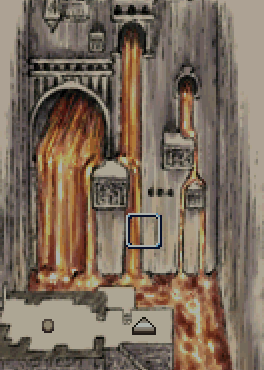

## 旅人的笔记

虽然日记的纸面早已残破不堪，

却有几处依稀可辨。

终于，找到了预言中的阿格迪乌。

必须带回这消息，并警告伙伴们：

不能让人们见到它，

不能让人们接触它。

但是，我已时日无多。

被令人憎恶的夜之诸鬼所伤，

出师未捷身先死，如此可叹。

好想再看一眼地上的太阳，

至少，要让这记录……

日记的文字在此终端。

并且，在翻开日记的内裱纸后，

发现上面署有哀里奥的名讳

---

## 纳里斯和纳姆里斯

希巴之地，双生子诞生于邬之都。

哥哥名为纳里斯，弟弟名为纳姆里斯。

他们诞生之时，各自承受了预言。

哥哥被如此预言：

这个孩子，不会死于利刃之下。

弟弟被如此预言：

这个孩子，不会死于人类手中。

后来哥哥被民众选为统领，怕被夺权篡位，

从首都流放了弟弟。

弟弟纳姆里斯对此怀恨在心，单身投奔艾戈的魔术王，劝诱了对邬之都的袭击。

艾戈的军队攻入了邬之都，拜仁的精锐队围攻哥哥纳里斯也奈何不了他。

这时弟弟纳姆里斯用棍棒袭击，并杀死了哥哥。因为他对哥哥的弱点了然于胸。

邬之都的灭亡之景，如今历历在目。

之后纳姆里斯的灵魂被囚禁，成为艾戈王迪多斯手下不死的魔将。

这就是纳里斯和纳姆里斯的故事。

---

## 拉格传

在北之地出生的拉格（LARG），虽然在年轻时就成为了巴施卢珥之王，却始终对死亡心怀畏惧。

这样的他为了探寻死亡之谜，用木鞭将大量的民众鞭打致死，因此被国民们所流放。

他在北方的荒野风餐露宿，终于病倒了。

矮人族的锻造师高里恩（GAWLIN）救起了落魄的她，

拉格为了报恩，法师要从恶龙斯泰特（SUTIT）手中夺回矮人族的秘宝。

他与高里恩一同来到火之国，在迷宫的伸出挑战恶龙斯泰特，并将其达到，

但矮人族的秘宝寄宿着不死的魔力，

拉格为其着迷，杀死高里恩窃取了秘宝。

他因着罪行而受到诅咒，变成了恶龙一般的存在。

即使游遍黄昏之国、死之国，也已经无法找到安息之地，终究还是回到了火之国。
在那里，他被妖术师迪多斯（TITUS）禁锢灵魂，

在永恒的痛苦之中终于求得永生。

这就是拉格之生平。

---

## 达玛迪乌斯传

达玛迪乌斯是艾兰卡人，在古王朝的最后时代出生于赤发埃奥族的族长家系，位列长子。

他幼年的成长经历不得而知，我们所知道的，

仅是他作为人质来到帝都之后的样子。

尽管在古王朝，又从属国的王子要与皇太子一起同窗，接受贵族式教育的战友组制度。

但以达玛迪乌斯的情况来说，他却真正如战友般忠心不二，成为尽忠尽责的三朝元老。

他擅长武艺，特别在枪击和马术上无人能出其右。

据说想与他分庭抗礼，非得有能防住他那贯通铁壁之枪的盾牌，以及能绊住他马脚的铁链不可。

但他却不知魔术技艺，终生未有学习。

他的谨严耿直为同时代人所熟知，

譬如他严格遵守关闭城门的门限，每次没能及时在太阳落山之前回到市内之时，他都直接在城门之下就地过夜。

他执法的严苛也为人所畏惧，不管是谋反者还是强盗，亦或不公正的税官及商人，就连行苟且之事的男女，甚至对主人顶嘴的奴隶女孩，都被他一视同仁地施以铁串贯穿躯体之刑，当街曝尸示众。

在赤发埃奥族发动叛乱时，他依旧作为帝国将军率军团前去讨伐，得胜后，他用铁串贯穿自己双亲凯旋而归。那些曾耻笑他出身蛮族之人得知后，对他的轻蔑从此转为了畏惧。

正因为这种性格，在迪多斯九世疯狂时，他也只是忠实地遵从皇帝命令进行杀伐。

迪多斯九世直到现在都恶名远扬，这其中应有几分责任由达玛迪乌斯担当。

后来他经由迪多斯十世之手化为不死的魔将，背负起永远守护帝都的使命。

他的使命被定为直到败给「等同于始皇帝之人」为止，但那究竟是指谁就不得而知。

---

## 伯兰梅亚的魔女

那是很久以前，在水獭还没有学会游泳时的故事，

在伯兰梅亚国有一位国王、五位王子和一位美丽的王女。

众多勇者络绎不绝地前来向王女求婚，但是谁也没能成功。

因为要与王女结婚，即必须通过伯兰梅亚国王设下的重重困难考验。

有一天，从西之国来了一位俊美的年轻人，很快他便与王女坠入爱河，提出了结婚的请求。

但国王却对年轻人极为不满，

因此他给了年轻人最为困难的考验。

那考研就是获取住在森林中的大白鹿的毛皮。

年轻人好不容易找到白鹿，正打算用剑将其斩杀时，

却在施以致命一击前被它逃脱了。

年轻人只凭自己是无论如何都无法杀死它的。

他去寻求王女的建议，王女告诉他：

见到白鹿之后，就请吹响这魔法之笛吧。

因为王女的母亲是魔女，她也能使用魔法。

于是年轻人在森林里找到白鹿后，

就用魔法之笛吹起了十分欢快的曲子。

白鹿听到曲子后，欢快地蹦着跳起舞来，

年轻人利用这个机会用弓箭射穿了白鹿的脑袋。

于是年轻人带着大白鹿的毛皮回到国王面前，

国王却反悔不承认，还想用剑砍死年轻人。

此时王女使出了障眼的魔法，

国王反而砍死了自己的小儿子。

王女和年轻人一起逃到了草原上，

但国王已经和四位王子一起追赶了过来。

这时王女把发梳投了出去，草原就燃起了熊熊大火，

国王和王子们都被火焰包围了。

已经被火烧着了胡子的国王大叫着：

不但想烧死身为父亲的我，连自己的兄弟也不放过，这时何等恶毒的女儿啊！

终有一天你也会被活活烧死的！

王女和年轻人一起逃到了西之国，

据说之后两人一起创造了他们自己的国家。

也有另一个版本说，王女后来背叛了年轻人，

独自一人去了夜之国。

---

## 柯·罗·摩

柯·罗·摩

七条命的柯·罗·摩

一个人踏上旅途柯·罗·摩

二叉道上迷了路发脾气

三个国家国王给了难题

四只眼的龙击败请务必

五道门挡不住所向披靡

六个年头过去终寻其迹

七次死亡后才把龙击毙

柯·罗·摩

柯·罗·摩

七条命的柯·罗·摩

---

## 来自皇女的听闻录

从幻之都的巫女处听到的话，并当场作的记录。

!!! quote ""

    「妾身名为尤利娅。乃初代皇帝神殿的侍神公主……

    即是有皇家血统的巫女」

    「妾身只因有皇帝的血脉，就被监禁于神殿，命中注定要嫁与那地下的怪物」

    「幸亏千钧一发之际帝国溃灭，妾身才避免了悲惨命运

    正当欣喜不已……」

    「却被精神失常的叔父和先祖那诡异的阴谋所连累，落得永远被幽闭于此之境遇」

    「汝应有所觉察。

    这都市，早已毁灭。

    妾身与民众，不过是死者之幻」

    「可是惧怕毁灭的皇帝，却把整个都城移动至生死之间，

    被称为忘却界（炼狱）这一方狭界之中」

    「并凭那些可怜人柱之脑中幻象维持着都城的苟延残喘，妄图永世长存」

    「妾身等人，在幻象的世界中，三千年间反复经历着覆灭之前数日间的光景，甚是空虚」

    「言归正传。

    妾身是鉴梦者，妾身的使命就是让寻求预言的人，看到预知之梦」

    「汝等也是，若想鉴梦的话就躺在这里，让汝观现世之梦。

    梦中入眠，梦回现世」

    「来吧，轻合双睑，

    来观遥远未来的预知之梦――

    汝的现世之梦」

    「吾等之梦，就是汝之现实。

    去吧，做汝该做之事」

---

## 皇帝の手記

好象是谁写的日记，但是并没有记载日期。

!!! quote ""
    『——据报艾兰卡人入侵东南属州拉蒂乌姆。

    朕不但增援了六个军团，还命令夜种加速交配繁衍。

    即位以来已有五次，蛮族实在无法无天。』

    『来自议院的使者到来，

    诸位长老不服朕的裁决。

    即便以皇帝之名，仍无法制止世家间的争斗。

    帝国夕阳日暮，朕无法超越父皇吗？』

    『天启降临。始皇帝之灵入朕梦中。

    授朕秘仪，是为指路明灯。

    朕乃天选之人，

    只觉力贯全身。』

    『遵循始皇帝引导，召集智慧超卓、沉浸魔道之辈，

    但尽是无能之辈，令神秘的知识，久衰不盛。

    直叫蛮族所效仿。

    朕于宫殿内外建立学院，下令钻研技术。』

    『为了使帝国永固，必须制作观梦石人，

    即变成基石并梦见帝国安泰的祭品，

    始祖皇之引导，令人费解』

    『（空白）』

    『虚幻的记忆日渐增多，

    操劳所致。』

    『（空白）』

    『（空白）』

    『（空白）』

    『被始皇帝算计，痛悔之极，

    朕只不过是他的依附之体。

    皇统十五代，都只不过是他的傀儡，

    与牛马无异。』

    『他叙述诸神的灾害，

    为了从地表抹去人的帝国，策动诸神，

    动员蛮族大军，引发天变地异。

    地狱之门始启，预言如是。』

    『朕被幻象吓得浑身颤抖，

    就如被操纵的亡灵。

    朕所继承的统治地上的皇帝之名，

    始皇帝对此嗤之以鼻』

    『守国重任，一肩在身。

    如今是十万火急。

    朕命令诸将，收集作为石人的人贽。

    剔除有异议的长老，现在的计划为重中之重。』

    『市场之外有骚乱，

    朕亲自领兵镇压，

    将犯人剥皮示众，

    赤裸哭喊之景惨不忍睹。』

    『河神教团诸人，于广场弹劾朕，

    逮捕他们丢作战鬼的美餐，

    愚者众多。』

    『重要之时将近，愚民却实在太多。

    为一己私愤，破坏和平作无益的叛乱。』

    『朕亲手处决已超千人，

    只有鲜血可以让朕安心。

    朕，是否已疯狂——』 

---

## 来自妖精王的听闻录

此为现场记录下的妖精王口述。

!!! quote "妖精王"
    「在诸神莅临大地，吾还侍于先王之时，人族不过是只会用河泥筑城、嗜好你争我夺的小种族而已」

    「有一天，一个人族少年来到森林中求学，

    他说为了救助同胞，想学习吾等的知识，

    那时的他心地善良而正直」

    「但是他作为人类，无法掌握魔术的奥义，种族的能力毕竟天生有限」

    「他只得叹着气离开了森林，但几十年后却率领着军队，以王者的身份重返了这里」

    「他用凌驾于吾等之上的魔术

    烧毁森林，夺取土地，

    杀害了吾等众多同胞」

    「……不知他离开森林后到底有何际遇，

    只不过，再会之时他已变成魔鬼」

    「他将吾等远古种族降服，收集俘虏运往建在河岸边的都城」

    「并将含有魔力的秘石赐予被囚诸王，

    被那魔性所缚，诸王便化为结界的一部分，成为了他的守护者」

    「凭此结界，他的都城得以不朽。

    太古种族之力连接于世界之根，

    将这力量控制，他便掌握了地上的王权」

    「但是，他那延续千年的帝国，终成为逆天之物，毁灭于诸神之手」

    「诸神察觉地上之人无法打破结界，于是就亲自引发洪水和地震，将整个都城封于地底」

    「……然而，只要守护者尚存，他就不会真正灭亡。

    即便经过万年，他也仍会复苏」

    「……只要、这守护者的秘石，

    ……还在吾手中的话」

    「是的，吾正是那皇帝的守护者之一。

    被秘石的魔力束缚了灵魂，无法超脱」

    「若想将他切实毁灭，便要将吾等杀败，

    以夺取四颗秘石，开启陵墓之路。

    然后踏过四王尸身，以灭其志」

## 塔之王国年鉴

叙述了矮人族悠久历史的文书残篇。

危门终破，隘边之民失却银门广场，逃出生天于汹涌来敌，仓皇亡命于回廊都市。

声名败落，加林、邬丽姆、鞑基虏之三王子，终被枭首示众也。

光辉不再，隘边之民匿踪蛰伏于岩屋。锤煅旧世遭诅咒夜神之剑。

三番不竟，四度终成。是为暗黑之刃也。

欲夺沦陷之王座，然未及出炉之时。隘边之民已灭绝殆尽。

待炉火烽彰，神剑终成，隘边之民灭族远遁，仅余一人也。

隘边之民回首顿悟，隐居于岩屋。待承剑之人，盼再起之时。

隐姓埋名，虽死无断。只待奉天承运者也。

---

## 霍尔姆的传说

霍尔姆地区历来就被称为关所之国，尽管处于大河中部流域要冲，但因山地、森林与湖泊繁多，即使到了近年，陆路交通仍然不甚兴盛。正因如此，像『河姑娘』那样，能以故事原始形态口耳相传至今的民间传说，在本地并非凤毛麟角。

并非凤毛麟角。

其中的一个典型就是以『妖精乡』为舞台的一系列传说。

『妖精乡传说』便是其代表作。

序幕是漂流到大河岸边的有着特别能力的婴孩，其后婴孩被收养，成长为英雄般的人物。

接着英雄被接待到位于地下的妖精乡，在那里取得了魔法之力。

那之后，英雄陆续打败龙人、魔术师和夜种等传说中的怪物，名声大噪。

最后，英雄离开了妖精乡，从此销声匿迹。

又或者是说他关上妖精乡之门，去了其他地方。

也有不少版本是说英雄获得了预知之力，最终完成了自己的冒险。

还有一种说法认为，如今继承霍尔姆伯爵之名的格林瓦德家的某位祖先，正是这位英雄。

根据史书资料的记载，格林瓦德家的祖先是在暗黑时代的末期，被委任剿灭魔国盗贼团的一名官吏，随后他在大战时期支持了大席瓦尔国一方，领受了伯爵的称号和领土。

乡野传说却与史书不尽相同。传说称，当时有魔术师在这片荒废之地上为恶，英雄格林瓦德将之消灭，并和当地族长的女儿结婚之后，便被妖精的声音召唤，投身湖水之渊。

---

## 河姑娘

在大河中部流域，流传着一个被认为与女神艾克薇尔相关的神话故事，内容如下。

!!! quote ""
    『――英雄提多斯与河姑娘相遇，很快两人坠入爱河，河姑娘将星之宝珠作为两人爱情的信物赠与提多斯』

    『即使后来提多斯为了拯救人民而踏上旅程，借宝珠的力量成为君王后，也未曾把河姑娘忘记』

    『但瓦兰的王女也爱上了他，就骗他喝下了遗忘之药，于是提多斯忘掉了河姑娘，娶了瓦兰的王女为妻』

    『河姑娘一直在等待着提多斯，十年、百年、千年……

    她终于等不下去了，为寻找提多斯而来到黄金之都』

    『在那里她所看到的是，已经忘掉一切，仅仅是呆坐在玉座之上的提多斯。

    河姑娘因他的背叛而发怒，于是令河川泛滥，洪水肆起，淹没了黄金之都和星之宝珠』

    『在黄金之都毁灭之后，河姑娘后悔了，她赐予提多斯留下的孩子祝福。

    那个孩子十分高兴，与河姑娘约定一定会为她找回遗失的星之宝珠』
---

## 无限宫的幻视者

新王朝初期的哲学家凯洛斯，曾在幻境之中来到被称为＜无限宫＞的地方，与始皇帝进行了交谈。

以这种体验为基础，凯洛斯如此述说道：
!!! quote ""
    「……葡萄树上绝对不会结出苹果之实，

    所有的鸡也都只是以鸡的形态而存在。

    这是因为世间万物，都有着其原初之形态」

    「与此相同地，吾等国家的法律也一样，必定有着由神所定的法之原典存在」

    「不论如何野蛮的国家，从身为指导者的王、以及禁止盗窃和杀人的方向来考虑，所制定的法律都是相似的。也可以说，地上的国家实为天上国度的投影」

    「正因如此，有雄心壮志构筑起伟大之国度者，不可不在国家的原始形态这个问题上，以理性和情感为桥梁来探索神明的真意」

    「追求真理的贤者们想必能够看到的吧。那建立于遥远的虚空之中，属于神明们的国都」

---

## 大恐怖的预言

### ～黄金的第五时代黎明～

皮洛斯·席凡涅斯 著

就像世上所有略通历史的人所知道的那样，这个世界已经经历了四个时代。

远古的黄金时代、古帝国时代、魔王统治的暗黑时代、然后是大席瓦尔王国的时代。

但到如今，大席瓦尔王国已经一分为三。

战乱不断扩大，大河流域不再统一，神殿自甘堕落，犯罪者、放债者、乞丐与日俱增，道德也已沦落，而且人们还都以为我是疯子。

不过，这也是被预定好的命运。

如同古代人所知，世界以数千年为周期，不断重复着衰退与再生。

就像大席瓦尔王国消灭魔王令世界复苏那样，这个时代也不过只是正处于破坏与再生的过程之中。

在大圣人艾鲁所记的圣典『诸神记』的最后一章中，记载着时间终结之时，全世界的都市都会因卷入对异教徒的战争战火而毁灭，而后，新的神明就会显现于世并拯救众生之事。

并且，在尤鲁弗莱尔岛的大神殿中，秘密藏有神帝记或是被称为提多斯·挪曼的预言书的断章。

此事在业界早已成为定论。

在那预言书之中，记载着永恒光之王将会复活起来，引导民众，并战胜邪恶的军团，令世界重新塑造一事。

据古代传说界的权威拉古巴特·Ｏ·海罗迪恩教授所言，在某个即使在偏远的涅斯公国中，也属僻乡穷壤的地方，竟发现了阿尔凯亚帝国时代的遗迹，这就是引发天地异变的原因所在。

想必各位也已知道，阿尔凯亚帝国虽然由伟大的魔术师，通过调和灵魂之力构建起强大的精神文明，但却由于其傲慢而导致恶之波动的积累，因而灭亡。

阿尔凯亚帝国遗迹之所以再度现世，不代表别的，正预示着现代文明因恶之波动满盈，即将迎来破灭的前兆。
这样下去世界便只有灭亡一途了。但是，如果多数人能够醒悟到真理的话，人类仍会被拯救，古代的文明也会以纯净的形态复苏。

恶人虽然会以最惨的形式死去，正直的人却能够幸存，并迎接第五次、而且是永恒的黄金时代的到来了。

真理，具体来说就是取回真正的信仰、拒绝颓废的娱乐方式、过上符合道德的家庭生活、消灭邪恶的异教士、进行健康的饮食、还有买我的书等等诸如此类事情。

---

## 刻在墓室壁画上的文章

『关于四颗秘石 以及光辉之伊泰利尔』

『 大河流域的统治者、阿尔凯亚的皇帝，

里加纳、席巴和多斯的庇护者、

北方诸国和艾兰卡人的征服者、伯兰梅亚的宰相，

谨以上述地位，迪多斯自神明之处获赠一颗宝石 』

『 那便是由大河化身，女神艾克薇尔亲赐，

诞生于生命之泉的——光辉之伊泰利尔。

伊泰利尔炼星辰为宝玉，是从无限的光明之中流淌出知识的大门 』

『 不久宝玉因恶神的嫉妒而碎成五块，变成了品质低劣的石头。

但才智多端的迪多斯又使用其中四块，在火之国的深炉中炼成四颗魔力之石 』

『 柘榴石之尼鲁萨，催生斗争的勇气。

翡翠之席尔巴，让持有者肋生双翼。

琥珀之艾尔雅，让持有者意如钢铁。

青金石之费阿，其光辉中凝聚神秘 』

『 便是这四颗秘石。

容纳秘石的台座是纯银所制，类似蛇形，又随时可以变形，

上面刻有祝帝国永存的咒文 』

『 它们蕴藏着极大■■■■■■，

所持者永久■诚■■■■。

皇帝将它们授予古代四族之王

并命令四王为其守墓 』

『 剩下的■■■■■，因为■■■具有■■■■，

被■■■■■■■■■■■，

当作■■■■■■■■■■，宫殿■■花园■■。

皇族便可代代由此获得智慧 』

『 这便是伟大的帝王迪多斯得以永世不朽，

继承阿尔凯亚帝位之人身附帝灵的原因，

因此迪多斯才具有至高帝之名 』

『 不死者迪多斯之灵沉眠在这片陵当中，

等待时机来临，身怀四颗秘石者重现。

若其人破坏四重守护来到迪多斯面前，

那一位，便将因此等同于迪多斯再临。 』

……文章到此为止。中间有几处文章被故意抹去，无法阅读。

---

## ～闻名世界之剑～

### 斩魔之剑

从异族的支配下解放了我等的＜斩魔之剑＞的实质是一个大谜团。

歌颂大战期间故事的『伊娲之歌』是如此传唱的：

历经漫长岁月，被夺取自由的年轻人们，

立于王位之上的是驯马者，统领狼群的魔王。

巫女们流传着预言，寻觅阿拉之塔，

王子与勇士们挺身而出，寻找穿越时空之剑。

在这里虽然被称为『穿越时空之剑』，

这是它原本的铭文，还是它的一个异名却不得而知。

据传剑位于阿拉之塔，阿拉是被哈鲁神击败、最早的天空神之名，暗示着此剑与太古之神存在着关联。

但在歌谣中，若依巡礼神殿的高僧之言：

    「从世界开始之前的世界，穿越时空而来。」

    降临于这个世界的话，此剑乃比诸神更古老之物。

根据某处传说，此剑有操纵命运之力，剑刃必定能命中敌人要害，并使持剑者回避攻击。

而且，此剑控制命运并于历代持有人中辗转，如果有必要的话，甚至会令持剑者灭亡。

传说中，某女因害怕勇士战死沙场而偷窃此剑，却被盗贼杀害于将成为战场之地。

剑落于小溪，却在决战之时被那名勇士所发现。

现在，此剑作为圣剑被保管于尤鲁弗莱尔的大神殿中，成为与异教徒之战中最后的王牌。

### 东方守护之剑艾俄鲁斯

大席瓦尔王国在开国之君死后，被王子们一分为三。

流传于其中之一、东部涅斯公国的便是名剑艾俄鲁斯。

艾俄鲁斯在黑暗时代的席瓦尔经无名的名匠之手锤炼而成，在与魔国的大战中活跃于阿雷姆之手。

战后，为了在东方的异民族之下守护国家，而将其授予涅斯大公，长期为其家族所持。

据传，此剑是以极轻金属所制的突剑，

柄装笼手，刃刻狮纹。

但是在王国历102年的席瓦尔继承战争中期，此剑被压在落马而亡的乌朗多公子身下，断为两截。

事后巡礼神殿的巫女，对名剑艾俄鲁斯作出了如下预言。

『在世界的中心，古国复兴之时，断剑将被重铸。

持剑之人，只要不停反逆所侍君主，就不会死亡』

这里的『古国』就是指席瓦尔王国，于三国被重新统一之时

艾俄鲁斯被修复，动乱再起――

预言是被如此解释的。

---

## 大河教典 (列神记&艾鲁之书)

### 列神记

一切始于众神之母夜，

而后光明来临，娶夜为妻，诞生了三柱之神。

是为天空之阿拉、大地之特雷斯、海之恩伯。

三位祖神互为夫妻，诞生了九柱之神。

就此天地间群神乱舞。

众神最小的弟弟哈鲁，挑战父亲天空与母亲夜并取得胜利。随后娶了森林之伊波，诞下了子嗣。

首先是长子，黑夜之密尔多罗。

寄居大地裂缝之奥罗里昂。

流浪之米亚库克，

审判者酷古，

光明之子拉，

月之颜密苏里迪奥，

以及众神之猎犬夏里克。

这些神诞生之后，哈鲁为了修建自家宅邸，用自己作为祭品向自身祈祷，呼唤来宇宙树。

宇宙树的根须坚固了世界，随后大河奔涌而出。

终于大河之女神艾克薇尔诞生了。

众神在宇宙树的树梢建立家园。树根下是冥府，群蛇踞窟。

大河流域成为小生物们的庭园。

上古世界就存在的巨人、龙和狼，虽与众神为敌，却不久后就屈服，成为助神之力。

最后世界终于完善。

### 艾鲁之书
人界之所以不完善、充满罪恶的原因，乃是由于从最初开始便存在了邪恶。

因为人在被创造时，黑夜之密尔多罗在作为材料的土壤中混入了自己的种子，从而使人性变得罪恶。

成为父神的哈鲁，打算毁灭恶劣成性的人类，却被大河之女神艾克薇尔制止，她愿代替人类承受罪恶被永远幽闭在牢狱。

吾等人类成为女神子民，正是从那一刻开始。

艾克薇尔出于慈悲之心授予人类智慧，人们却用之建立罪恶国度，于是女神遵守与父神的契约自引洪水将罪恶之都毁灭，放弃神山之位被封印于地底。

那时，艾克薇尔从洪水中救起大圣人艾鲁，命他建立神殿引导众人。

艾鲁是这样叙述的。

    「汝等怀恶而生、罪行累累之人啊，本应因此断绝生机，却因为地底深处那位恩主的原谅，方能如此歌颂生命」

    「已经被许诺地上的繁荣与树上的乐园，为何还如此执迷不悟？

    为何你们这些人，依然不愿相信，女神的原谅和救赎」

通过信奉艾克薇尔，人类才能摆脱原罪得到救赎，这便是他的提点。

---

## 历史

### 神代(约数万年～约3000年前)

据传在有史以前，曾经支配世界的是与现存人类不同的原住民种族

不过，吾等的祖先是在迁入大河河口的平原后，靠农耕生产才建立起人类史上第一个都市国家。

### 帝国时代(约3000年～约2000年前)

而后，大河中游的都市国家将其他都市置于麾下，成就了足以号称帝国的大国。

这个国家被后世称为阿尔凯亚或是艾戈，帝国的详情在史书中却一概未有记述。

据闻，虽然帝国的统治时期长达了千年之久，但它最终却毁于一场大洪水之中。

人类的文明曾在此一度断绝，只有在大河河口周边的国家，方能看到帝国昔日繁荣的点点痕迹。

### 暗黑时代(约2000年～约300年前)

一般将此时代划分为前期、后期两代。

前期是中小国家割据征战的战国时代，后期则是遭受异人侵略的抗争时代。

据称在前期有瓦兰和北域王国等王朝鼎立，虽经历几度的盛衰流转，但因未有留传详尽的文字记录，而使考证陷入迷雾。

在后期之中，东南部荒野地区的游牧民兴起，创建信仰密尔多罗神的魔国玛鲁迪利亚，一举侵入大河流域。

他们的王被称为魔王，据称拥有着支配混沌的力量。

魔国虽然迫使大河流域多数国家沦为其附属，但因魔王的统治过于残酷，抗争屡屡频发，其后诸国组成以席瓦尔国为中心的同盟，共同对抗魔国。

最终『斩魔之剑』被英雄所发现，同年，玛鲁迪利亚的魔王战死。

席瓦尔王借此一手统一了大河流域诸国，从此开始了王国的历史。

### 王国时代(约300年前～)

大席瓦尔王国的初代皇帝是阿雷姆，他在死前将王都及其周边领地托付于长子，次子和三子分别被封予南方和东方公国。

王国历48年，阿雷姆逝世后，长男立即主张自己拥有对两公国的宗主权，却被弟弟们拒认。

大席瓦尔王国就此分裂为西席瓦尔、涅斯公国、艾鲁帕迪亚公国三个国家。

王国历87年，围绕着西席瓦尔的王位继承权问题，兴起了席瓦尔继承战争。

王国历102年，第二次席瓦尔继承战争爆发，三个国家的疆域逐渐确立为如今的形态。

王国历148年，艾鲁帕迪亚战争开始，大河大神殿发表了中立宣言。

王国历151年，两岸纷争爆发，自由都市国家群体独立。

王国历205年，玛土撒拉教国兴立于哈索内海沿岸。

王国历209年，神殿同盟结成，第一次圣战伊始，此后同盟与玛土撒拉教国的对抗也时有发生。

王国历267年，围绕基鲁山地南东部的归属权问题，拉洛兹安战争在西席瓦尔与涅斯公国之间开始。

---

## ～键之书～

### ～键之书上～

——你试着打开『键之书』，确认其中的内容。

看起来，这本书记载着学习某种高超魔术所需的法门和注释。

古代星神的名字、发音记号、星系位置相关、天界和地上的人类的精神照应法则、将魂魄转移到异世界以获得不死的方法等等概要，多数的记载都是现在已经失传的知识。

但是，读到最后你却大失所望。

书的后半部分，被一点不剩地撕去了，那才是记载着魔术的关键部分。

正当束手无策之时，

你的脑海中突然浮现出某处的景象——

——在荒废已久的废墟深处，书架林立的迷宫之底，『键之书』的另一部分就沉睡在那里——

### ～键之书下～

在『键之书』的后半部分中，极端难解的咒语密密麻麻地写满了张张书页。

    「横渡以太之海，获取星辰智慧之枝」

注释里如此注明着。

初看之下似乎完全无法解读，但如果利用从前半部分所学知识的话，应该可以理解其中的内容。

这些咒文仅凭阅读行为自身就会发挥魔术效果

令术者的精神发生飞跃性的变化。

键之书

取回了原本形态的『键之书』正在你手中。

你以仅有的一点头绪，解读了复杂的文字序列，你渐渐能将其作为一种咒文或读音辨认出来了。

刚刚被识别出的字句自动经由你的大脑驱动声带，在胸腔内引发出精神共鸣。

这么做本身就具有魔术效果，它将在你的体内作成回路令咒文不断循环，将各种内脏转换为炼金之炉。

仅仅依靠阅读一本书，就达到了与高超的仪式魔法相媲美的效果，让你的精神飞跃性地变化。

散发着光芒的咒文序列在空中实体化，就连空间也在被扭曲着，随后――

 

 

 

 

 
至高天

——你远离生养自己的母星，不远万里地来到这里。

回头望去，连太阳也变成了在彼方闪烁的一个微弱光点。

伟大的种族

来到这里的话，凭吾一己之力也能从星系的力场当中脱离了

多亏你们，吾能返回故乡的时空了！十分感谢

吾就把技能点数作为谢礼吧！

获得2点SP！

那么，咱们就后会有期了！

异星人留下道道光痕，消失在虚空之中……

你继续向前走去，终于，你在前方看到了要称之为行星就显得过于渺小的矮星。

它沐浴着远道而来的阳光，在一片黑暗中不起眼地漂浮着。

一道人影耸立在白色地表之上，它迎接了你的到来。

键之守护者

此处是世界尽头，母星加护断绝之地。

若想继续前行，就必须先击败我。

你获得资格了。

过去曾有无数人通过此处，但归来者却不及一手之数。你又会否选择归还的道路？

来，尽管上路吧。

——从太阳之中吹来的热风，守护了居住在行星上的生物，令它们免受外宇宙的影响。

有害的力量和侵略者都被太阳风驱逐在外，要侵入星系中心并非易事。

在行星表面初生的幼年文明，便在太阳的庇佑下渡过它的幼年期。但若是它想追求更高的目标，就必须从这庇佑中脱离而出。

眼前的空间出现了一道石门，

随即——

从前被太阳风这段，你没能听到的歌声，如今却清晰地从银河中心核的方向传来。

那充满调和的音节，不断地咏颂着过去、未来所发生的一切事情。

那是以太古种族之歌为始，即使跨越终末，也依旧无休无止的天球之曲，是以宇宙本身为乐器，由神秘音律而成型的永恒之珈蓝。

在那音乐之中，一切皆为正确、皆为至福。

只有具备资格者，才能听到这音乐，并参与其中。

你也想加入歌中，伴随着音律永远随波逐流下去。

/回到故乡

但是，你还有没完成的事情。你的内心从无限之光中剥离而出。

但曾经触及永恒的记忆，却仍然残留在你的灵魂中。

回去吧。

在你这么想着的瞬间，一切都化为奔流消逝而去。

瞬息之间你跨越无线距离，重新回到了肉体当中。

下坠感

以及初生之痛——

你回过神来的时候，发现同伴们正担心地注视着你。

/选择永恒

在接触到这份至福后，地上的纷争已经变得毫无意义。

你的自我熔入虚空，化为音节，在永恒的调和之中成为了久远——

——不可！

汝乃背负久远前世因果之身，在往复于无限轮回、迎来宿命之时前，

汝之救赎将永不得如愿以偿！

从内测溢出的某个意志，却从无限之光中把你剥离了出来。

——不要。

不想回去。

你回过神来，发现自己回到了地面上。

你的脸颊被泪水浸湿，丧失的悲痛令身体颤抖不已。

在触及永恒的那一瞬，你本已获得全知全能。

但如今那种感触却仅仅作为魔力残留了下来。初代的迪多斯是作为王子出生，在牧民的族长家中被养育成人，日后建立了帝国。

在他统治之下，人类智慧开化，优于其他种族。

他的统治一直持续了一百四十四年。

迪多斯二世虽为异形，但德被四海。

他整备帝国的法律和军队，九十六年之间统治平稳，

在他的统治下，人类理解了和平。

但他在年老之时却变得疯狂，开始以人类为食，

后经柯·罗摩之手被关入墓所的地下迷宫之中。

并每年为其献上一名活祭品，此事在这以后也经年持续着。

迪多斯三世被始祖赐予皇帝的称号，

他自己也在四十八年之间如此自称。

他率领军团远征，得到了众多的奴隶，

还讨伐蛮族，令诸王宣誓效忠。

迪多斯四世拜席巴的哲人伊库泰斯为师，

他建立了汇集诸国知识的大图书馆。

在他的引导下，智者们的才智直抵星辰。

他统治帝国长达二百八十五年，随后自己走进了墓室。

迪多斯五世的信仰虔诚，他将诸国的神殿集于帝都，

每天都举行一次祭祀，奉上了大量的活祭。

他向神明乞求如父皇般长生不死，却未得到回应，

在六十五年的统治后被安葬于墓室。

迪多斯六世深信自己在魔术上登峰造极堪比神明，

因此他在墓所之上建起了祭祀自身的大神殿。

但是后来发生叛乱时，他被逼入大神殿，在那里

自我了断，他的统治持续了三十七年。

迪多斯七世被诸王操纵，作为傀儡女帝登基。

但她在不久后，就反将诸王摆布于手掌之中。

在她的统治下法律公正无私，人民安享和平，

但是在她治世八十六年之后，因杯中被人下毒而殒命。

这七代的迪多斯王每一位都有如神明般优秀而伟大。

因而七帝时代是帝国的黄金时期，

是帝国人民最为幸福的时代。

迪多斯八世虽然也由诸王推举为女帝，但她立即

就翻脸杀死了多恩王，自己统治起整个帝国。

她虽然建立亲卫队来对抗诸王，但很快也像其母帝

一般被人毒杀，其统治仅维持两年。

迪多斯九世为寻找杀死姐帝的真凶而癫狂，

亲手杀掉了自己的多数臣子。

尽管诸王和大臣们都畏惧他，他却反被人民所崇拜，

人民称他为切碎罪恶之人、众神的皇子。

但他的亲卫队却发生了叛乱，于宫殿走廊上

追上并杀死了他。

其统治时间为五年。

迪多斯十世由先前两位有两代血缘之隔的皇帝近亲所生，

因是异形而遭到排斥，自出生后就一直被幽闭在陵墓中。

在要作为新帝登位被放出来的时候，

它当即杀光了宫殿中的全部亲卫队、大臣和诸王。

之后它在帝都中徘徊，见人就杀。

它已成为死亡的化身，在它的杀戮之下人人平等。

惧怕它的国民全都从帝都中出逃，诸王也纷纷反叛，

各下属州的统帅也各自以王的身份自居。

帝都阿格迪乌仅剩下它一个人在永远徘徊，

最终城墙崩毁，森林逐渐覆盖于其上。

再也没有人见过的它，由此成为了传说。

它的统治时间不计其数。

就这样阿尔凯亚的古王朝灭亡了，

伟大的时代成为了过去。

此时是阿尔凯亚的帝位空悬的时代，诸国骚动不安，

互相争战。

身陷不幸的人们，期待着皇帝的出现。

作为继承皇帝血脉之人的迪多斯十一世在伯兰梅亚 出生，注定背负起拨乱反正的使命。

但他却被国家放逐，作为一名战士在诸国流浪，

吸引并统帅了诸多流浪之人。

不久他经由始皇帝的引导找到了阿格迪乌，

他见到帝都人民的贫困时十分悲伤，负起了王之重任。

在他的统治下，帝都得以再兴。

当诸国的抗争威胁到阿格迪乌之时，

他主动起兵，令阿尔凯亚之名重兴。

阿尔凯亚兵再次征服了诸国，

剿灭了三大国家，令帝国重新兴盛。

他在登位之后使用迪多斯十一世的名号，

作为新王朝的太祖对帝国进行了长期的统治，

他的治世持续了五十九年。

在迪多斯十二世的统治时期，

帝国因众多叛乱而陷入混乱。

于是他亲率军团巡游领地，四处剿灭乱臣贼子。

他在位的三十六年之间，从未把行宫固定在一处。

在迪多斯十三世统治时期，因敌患消失，帝国得以安定。

但他却建起了斗技场，令人民时刻不忘战争之心。

他的统治持续了十八年。

迪多斯十四世效仿古王朝的方法整顿法制，

想要通过传播信仰给人民以智慧，

但宦官们却阴奉阳违。

她的统治持续了二十五年。

迪多斯十五世并未多有作为，对民众采取放任态度。

在他的统治下商业和神殿兴旺起来，

大河之上尽是商船来往。

他的统治持续了四十二年。

新王朝仍在继续，如今在皇帝迪多斯十六世的统治下，

古代的魔术再度复苏。

众神啊，请守护我等的都城，守护皇帝的荣光吧！

阿格迪乌啊，愿您永世昌盛！

---

## 好孩子神话 1~4
～讲给好孩子们听的神话传说

### １～女神的调停

很久很久以前 神明们的父亲哈鲁大神

在打倒了古暗神龙神之后

决定创造一个新的世界

神明们献上祭品虔诚地祈祷

就有一棵巨大的树木从天空的另一边落下扎根

于是世界就牢固多了后来从大树的根部

诞生出了大河的女神艾克薇尔

哈鲁大神在树顶建起了神殿

把神明们集中起来然后他说

『让世界变得充满生命吧』

伊波神在森林中变出了动物和妖精们

奥罗里昂神在山中造出矮小的人

恩伯神在海中放养了无数的鱼

到了最后哈鲁大神造出了人类

密尔多罗神却暗中动了手脚

在人类的种子上施加了诅咒

由密尔多罗神的诅咒而诞生的人类

总是喜欢恶作剧给大家制造麻烦

哈鲁大神发怒了把密尔多罗神关进了大树的

底部还想把人类也全部清除掉

但是 大河的女神艾克薇尔非常温柔

她为人类出面调停

『人类们如果由我来引导

一定能成为优秀的生命』

哈鲁大神回答道

『那好吧

 但是作为交换为承担人类所做坏事

的责任你也要一起被关进牢房』

『而且如果有做了坏事的人类出现

你必须要亲手将他毁灭』

之后人们就于大河流域安居

一边向女神大人祈祷一边生活了下去

所以大家也要听从女神大人的教导

将来一定要成为优秀的人哦

### ２～贪婪的大王

很久很久以前的人们淳朴又善良，

妖精和小人们过着和平的日子。

这时某个地方，一个贪婪的男人出现了。

男人到了大河女神那里向女神乞求：

「请给我大麦饱满的种子，我想让伙伴们的填饱肚子」

男人把得到的种子撒在沼泽里，

唰啦唰啦！恶鬼的军队长了出来。

第二天男人又去向女神许愿：

「请把火给我吧我想要做锄头和铲子。

为了伙伴，我得挖出大块的田地」

男人用得到的火铸成了铁，

叮叮咣咣！

造出了好多的武器。

接下来的一天，男人又向女神祈愿：

「请教我魔法，我想在碰到暴风雨、干旱的时候，保护农田」

男人将学来的咒文反过来读，

哗！啪啪！噼里哗啦！

雷电、火球从天而降。

男人拥有恶鬼的军队、铁制的武器、魔法咒文

成为一个邪恶的大王

他蛮横粗暴，奢华淫靡，杀光了妖精、小人和善良的人们，夺走了宝物

人们学着他的样子都成了恶人。

看见这幅景象的女神留下了悲伤的泪水。

噗哗！

泪水变成了洪水，把贪婪的男人的王国冲走了。

从那时起我们只使用被神明所认可的魔法。

恶王的子孙躲进了森林。

### ３～两只方舟

女神 决定将 人类的国家毁灭

因为 这是女神的使命

但是她想拯救 那些心地纯洁的人类

女神对一个叫艾鲁的男人说

『马上 就要下大雨 城市会被毁灭

快造出方舟 准备好』

艾鲁 收集了很多木材

造出巨大的方舟后 会载上

纯洁心灵的人们 和动物

城市里 大家都在嘲笑艾鲁

但是 邪恶的国王明白了

艾鲁所做的事

国王也学着艾鲁的样子 用鞭子

抽打着奴隶 让他们建造黑色方舟

这段时间里 空中倾下大量的雨

城市和山都被淹掉了

整个世界就如同一片汪洋那样

艾鲁建造的四角方舟 被大雨冲走

突 突 的向着西边飘去

持续了四十四天的漂流

方舟卡在了山顶上 停了下来

终于 大水退去 艾鲁来到了外面 很高兴

在那里坐落着一座神殿 之后为人们指明道路

这就是 尤鲁弗莱尔岛 的大神殿

另一方面 邪恶的国王 建造的黑色方舟

却没在再水上浮起 沉没了

所以 现在 邪恶的国王 仍然

沉于河底 反省着

～完～

### ４～王子和勇士消灭魔王

听从了艾鲁的忠告被拯救的人们

过着和平的生活

另一方面 魔王军队 从东边的尽头过来了

给人们带来了许多困扰

魔王 指使 粗野的马怪 和狼群

摧毁国家 在很长的一段时间里 逗留于此

大家 非常困窘

被魔王弄伤后 受伤的人

会受到很厉害的诅咒 然后死去

所以 谁都不敢反抗魔王

这时 席巴国的王子 想起来反抗

却被大家制止了

「你要是 乱搞的话

连我们 都会被魔王欺凌了」

当王子犹豫的时候 国中第一的勇士

过来对他说

「要是这样 集合所有的国家 打倒魔王不就好了

你 真是个胆小鬼」

两人 大吵了一架 最后还是勇士胜了

所以 王子集合王国间 所有的勇士

和同伴 踏上了反抗魔王的旅程

看到此景 哈鲁大神 非常佩服

他说

『你们真是 伟大 我就将

能消灭魔王的剑 的下落告诉你们吧』

得到了 可以杀死魔王的剑

锵！ 锵！ 将剑重新锻造

成了一把 闪闪发光的宝剑！

王子和勇士 将魔王的军队 很轻松

的消灭后 来到了东边的尽头

魔王出现了 两人一起

向着魔王发起挑战

经过长时间的战斗后 魔王非常虚弱 他说

「给我 最终一击的家伙 可是会中诅咒死的哟

你们两人里 想死哪个呢」

坏心眼的魔王 想让这两人起争执

但是两人 没有发生争执

「你 回国 成为王吧」

这样说着的勇士 从王子手上夺过

斩魔的宝剑 毫不犹豫的 刺死了魔王

这样 魔王被终结了 而勇士

也受到了魔王的诅咒 死去了

王子悲痛欲绝 将斩魔的宝剑 带回去

在尤鲁弗莱尔大神殿里 用剑做成了墓碑

终于 王子将被魔王搞的乱七八糟的各个国家

恢复了繁荣 被后人称为

席瓦尔大王

～完～
